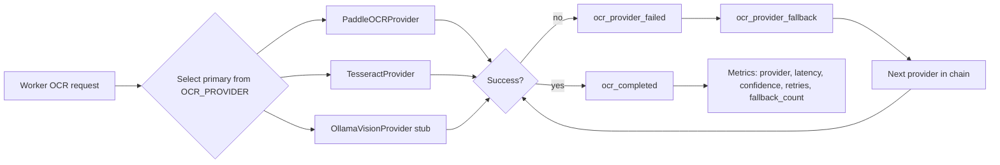

# LokLingo API Documentation

**Version:** 1.0  
**Last Updated:** May 2026

## Overview

LokLingo is a multilingual document translation and optical character recognition (OCR) service. The API provides both synchronous and asynchronous endpoints for:

- **Text Translation**: Real-time translation of text between languages using LLM providers
- **Image Translation**: OCR + translation of image files containing text
- **PDF Translation**: Bulk translation of PDF documents with multi-page support
- **Async Job Management**: Monitor long-running translations with polling or event streaming
- **Reliability Metrics**: Query provider health, queue depth, and translation performance

## OCR Provider Architecture

LokLingo uses a pluggable OCR provider chain in the backend worker while keeping the same public HTTP APIs.

- Primary provider is selected by `OCR_PROVIDER`.
- Supported values: `paddle`, `tesseract`, `ollama`.
- If the primary provider fails or returns invalid OCR output, the backend automatically falls back to the next provider.
- Frontend and API routes remain unchanged.



### OCR Observability Events

Structured logs emitted by the OCR chain:

- `ocr_provider_selected`
- `ocr_provider_failed`
- `ocr_provider_fallback`
- `ocr_completed`

## Base URL

```
https://api.loklingo.example.com/api/v1
```

For development:
```
http://localhost:13000/api/v1
```

## Authentication

### Write Operations (POST)

Write endpoints (`/api/v1/translate*`, `/api/v1/jobs*`) require authentication via one of:

**Option 1: X-API-Token Header**
```bash
curl -X POST https://api.loklingo.example.com/api/v1/translate \
  -H "X-API-Token: YOUR_API_TOKEN" \
  -H "Content-Type: application/json" \
  -d '{"text": "Hello", "source": "en", "target": "es"}'
```

**Option 2: Authorization Bearer Token**
```bash
curl -X POST https://api.loklingo.example.com/api/v1/translate \
  -H "Authorization: Bearer YOUR_API_TOKEN" \
  -H "Content-Type: application/json" \
  -d '{"text": "Hello", "source": "en", "target": "es"}'
```

### Internal Operations (GET)

Metrics and internal endpoints (e.g., `/api/v1/metrics/*`, `/api/v1/jobs/dead`) require:
```bash
curl https://api.loklingo.example.com/api/v1/metrics/providers \
  -H "X-Internal-Token: YOUR_INTERNAL_TOKEN"
```

### Development Mode

In development (`APP_ENV=development`), authentication is optional for write routes. In production, both `WRITE_API_TOKEN` and `INTERNAL_TOKEN` are required.

## Health & Status Endpoints

### Health Check
```
GET /health
```

Returns basic service liveness.

**Response (200 OK):**
```json
{
  "status": "ok",
  "service": "loklingo-backend"
}
```

### Readiness Check
```
GET /ready
```

Returns readiness status including dependencies (Redis, providers, OCR service).

**Response (200 OK):**
```json
{
  "ready": true,
  "details": {
    "redis": "connected",
    "ocr_service": "available",
    "translation_providers": "configured"
  }
}
```

## Core Translation Endpoints

### Synchronous Text Translation

**Endpoint:**
```
POST /api/v1/translate
```

**Authentication:** Required (Write API Token)

**Request Body:**
```json
{
  "text": "The quick brown fox jumps over the lazy dog",
  "source": "en",
  "target": "es"
}
```

**Parameters:**
- `text` (string, required): Text to translate (max ~5000 words)
- `source` (string, required): BCP 47 language code for source language
- `target` (string, required): BCP 47 language code for target language

**Response (200 OK):**
```json
{
  "translated_text": "El rápido zorro marrón salta sobre el perro perezoso",
  "source": "en",
  "target": "es",
  "cached": false
}
```

**Response (202 Fallback - Provider Overload):**
If all providers are saturated, the response may be 202 with a `job_id` for polling:
```json
{
  "job_id": "a1b2c3d4-e5f6-47d8-9e0f-1a2b3c4d5e6f",
  "correlation_id": "req-123456",
  "status": "pending"
}
```

**Status Codes:**
- `200 OK`: Translation successful
- `202 Accepted`: Job queued (fallback when providers saturated)
- `400 Bad Request`: Invalid input (missing fields, unsupported language)
- `413 Payload Too Large`: Text exceeds maximum length
- `429 Too Many Requests`: Rate limit exceeded
- `500 Internal Server Error`: Provider error or service issue

**Error Response:**
```json
{
  "error": "unsupported language pair: en -> xyz",
  "code": "Bad Request",
  "request_id": "req-123456"
}
```

---

### Synchronous Image Translation

**Endpoint:**
```
POST /api/v1/translate/image
```

**Authentication:** Required (Write API Token)

**Request:**
- Content-Type: `multipart/form-data`
- Field: `image` (binary file)
- Field: `source` (string, optional): Source language (auto-detected if omitted)
- Field: `target` (string, required): Target language

**Example:**
```bash
curl -X POST https://api.loklingo.example.com/api/v1/translate/image \
  -H "X-API-Token: YOUR_API_TOKEN" \
  -F "image=@document.jpg" \
  -F "source=auto" \
  -F "target=es"
```

**Response (200 OK):**
```json
{
  "original_text": "The quick brown fox...",
  "translated_text": "El rápido zorro marrón...",
  "source": "en",
  "target": "es",
  "ocr_confidence": 0.92,
  "page_count": 1
}
```

**Constraints:**
- Maximum file size: 25 MB (configurable)
- Supported formats: JPEG, PNG, PDF (single page)
- Maximum concurrent in-flight requests: 8 (configurable)

---

## Asynchronous Job Endpoints

For larger documents, long-running translations, or batch processing, use async job endpoints.

### Create Text Translation Job

**Endpoint:**
```
POST /api/v1/jobs
```

**Authentication:** Required (Write API Token)

**Request Body:**
```json
{
  "text": "Very long document text...",
  "source": "en",
  "target": "es",
  "mode": "translate"
}
```

**Parameters:**
- `text` (string, required): Text to translate (no upper limit)
- `source` (string, required): Source language
- `target` (string, required): Target language
- `mode` (string, optional): Job mode; default is `"translate"`

**Response (202 Accepted):**
```json
{
  "job_id": "a1b2c3d4-e5f6-47d8-9e0f-1a2b3c4d5e6f",
  "correlation_id": "req-123456",
  "status": "pending"
}
```

The `job_id` is used to poll job status and retrieve results.

---

### Create Image Translation Job

**Endpoint:**
```
POST /api/v1/jobs/image
```

**Authentication:** Required (Write API Token)

**Request:**
- Content-Type: `multipart/form-data`
- Field: `image` (binary file, required)
- Field: `source` (string, optional): Source language
- Field: `target` (string, required): Target language

**Response (202 Accepted):**
```json
{
  "job_id": "b2c3d4e5-f6a7-48e9-af10-2b3c4d5e6f7g",
  "correlation_id": "req-234567",
  "status": "pending"
}
```

---

### Create PDF Translation Job

**Endpoint:**
```
POST /api/v1/jobs/pdf
```

**Authentication:** Required (Write API Token)

**Request:**
- Content-Type: `multipart/form-data`
- Field: `pdf` (binary file, required): PDF document
- Field: `source` (string, optional): Source language
- Field: `target` (string, required): Target language

**Example:**
```bash
curl -X POST https://api.loklingo.example.com/api/v1/jobs/pdf \
  -H "X-API-Token: YOUR_API_TOKEN" \
  -F "pdf=@document.pdf" \
  -F "source=en" \
  -F "target=es"
```

**Response (202 Accepted):**
```json
{
  "job_id": "c3d4e5f6-a7b8-49fa-b011-3c4d5e6f7g8h",
  "correlation_id": "req-345678",
  "status": "pending",
  "estimated_pages": 12
}
```

**Constraints:**
- Maximum file size: 25 MB (configurable)
- Maximum pages: 300 (configurable)
- Supported format: PDF only
- Page translation is parallelized with configurable concurrency

---

### Get Job Status

**Endpoint:**
```
GET /api/v1/jobs/{job_id}
```

**Authentication:** Optional (public access if job is owned)

**Response (200 OK) - Pending:**
```json
{
  "job_id": "a1b2c3d4-e5f6-47d8-9e0f-1a2b3c4d5e6f",
  "correlation_id": "req-123456",
  "status": "processing",
  "mode": "translate",
  "created_at": "2026-05-14T10:30:00Z",
  "updated_at": "2026-05-14T10:31:45Z",
  "progress": {
    "current_page": 2,
    "total_pages": 5
  }
}
```

**Response (200 OK) - Completed:**
```json
{
  "job_id": "a1b2c3d4-e5f6-47d8-9e0f-1a2b3c4d5e6f",
  "correlation_id": "req-123456",
  "status": "completed",
  "mode": "translate",
  "created_at": "2026-05-14T10:30:00Z",
  "updated_at": "2026-05-14T10:35:20Z",
  "translated_text": "El rápido zorro marrón...",
  "source": "en",
  "target": "es"
}
```

**Response (200 OK) - Failed:**
```json
{
  "job_id": "a1b2c3d4-e5f6-47d8-9e0f-1a2b3c4d5e6f",
  "correlation_id": "req-123456",
  "status": "failed",
  "error": "provider timeout after 3 retries",
  "created_at": "2026-05-14T10:30:00Z",
  "updated_at": "2026-05-14T10:45:00Z"
}
```

**Job Status Values:**
- `pending`: Job created, waiting to start
- `processing`: Translation in progress
- `completed`: Translation successful
- `failed`: Translation failed (error details included)
- `cancelled`: Job was explicitly cancelled

**Status Codes:**
- `200 OK`: Job found and returned
- `404 Not Found`: Job ID does not exist
- `410 Gone`: Job has been archived (older than retention period)

---

### Stream Job Events

**Endpoint:**
```
GET /api/v1/jobs/{job_id}/events
```

**Authentication:** Optional (public access if job is owned)

**Returns:** Server-Sent Events (text/event-stream)

**Example Response:**
```
data: {"job_id":"a1b2c3d4-e5f6-47d8-9e0f-1a2b3c4d5e6f","event":"started","timestamp":"2026-05-14T10:30:05Z"}
data: {"job_id":"a1b2c3d4-e5f6-47d8-9e0f-1a2b3c4d5e6f","event":"page_completed","page":1,"timestamp":"2026-05-14T10:30:15Z"}
data: {"job_id":"a1b2c3d4-e5f6-47d8-9e0f-1a2b3c4d5e6f","event":"page_completed","page":2,"timestamp":"2026-05-14T10:30:25Z"}
data: {"job_id":"a1b2c3d4-e5f6-47d8-9e0f-1a2b3c4d5e6f","event":"completed","result":"success","timestamp":"2026-05-14T10:30:35Z"}
```

**Event Types:**
- `started`: Job processing began
- `page_completed`: A page (or chunk) was translated
- `provider_retry`: Provider failed, retrying
- `completed`: Job finished successfully
- `failed`: Job encountered an unrecoverable error

**Usage in JavaScript:**
```javascript
const eventSource = new EventSource('/api/v1/jobs/a1b2c3d4-e5f6-47d8-9e0f-1a2b3c4d5e6f/events');

eventSource.onmessage = (event) => {
  const data = JSON.parse(event.data);
  console.log('Job event:', data.event, data);
  
  if (data.event === 'completed' || data.event === 'failed') {
    eventSource.close();
  }
};

eventSource.onerror = () => {
  console.error('Event stream error');
  eventSource.close();
};
```

---

### Download Job Output

**Endpoint:**
```
GET /api/v1/jobs/{job_id}/output
```

**Authentication:** Optional (public access if job is owned)

**Query Parameters:**
- `format` (string, optional): Output format
  - `json`: Structured JSON (default for text jobs)
  - `txt`: Plain text (default for text jobs)
  - `pdf`: PDF file (available for PDF jobs)

**Response (200 OK) - Text Job:**
```
Content-Type: application/json

{
  "translated_text": "El rápido zorro marrón...",
  "source": "en",
  "target": "es",
  "word_count": 42,
  "pages": 1
}
```

**Response (200 OK) - PDF Job:**
```
Content-Type: application/pdf
Content-Disposition: attachment; filename="document_es.pdf"

[Binary PDF content]
```

**Status Codes:**
- `200 OK`: Output ready
- `202 Accepted`: Job still processing
- `404 Not Found`: Job not found
- `409 Conflict`: Job failed (no output available)

---

## Metrics Endpoints

All metrics endpoints require `X-Internal-Token` header.

### Provider Health Summary

**Endpoint:**
```
GET /api/v1/metrics/providers
```

**Authentication:** Required (Internal Token)

**Response (200 OK):**
```json
{
  "generated_at": "2026-05-14T15:30:00Z",
  "providers": {
    "litellm": {
      "status": "healthy",
      "success_rate": 0.98,
      "avg_latency_ms": 450,
      "last_request_at": "2026-05-14T15:29:58Z",
      "timeouts_total": 3,
      "retry_attempts_total": 12,
      "policy_score": 0.95
    },
    "ollama": {
      "status": "degraded",
      "success_rate": 0.85,
      "avg_latency_ms": 2100,
      "last_request_at": "2026-05-14T15:29:55Z",
      "timeouts_total": 8,
      "retry_attempts_total": 24,
      "policy_score": 0.72
    }
  }
}
```

---

### Provider Health Details

**Endpoint:**
```
GET /api/v1/metrics/providers/health
```

**Authentication:** Required (Internal Token)

**Response (200 OK):**
```json
{
  "generated_at": "2026-05-14T15:30:00Z",
  "health_snapshot": {
    "litellm": {
      "is_responsive": true,
      "last_response_time_ms": 450
    },
    "ollama": {
      "is_responsive": true,
      "last_response_time_ms": 2100
    }
  },
  "degraded_signals": {
    "is_degraded": true,
    "render_fallback_active": true,
    "ocr_low_confidence_threshold_exceeded": false
  },
  "adaptive_concurrency": {
    "current_max_concurrent": 8,
    "reduce_events_total": 2,
    "boost_events_total": 1,
    "clamp_events_total": 0
  }
}
```

---

### OCR Metrics

**Endpoint:**
```
GET /api/v1/metrics/ocr?window=24h
```

**Authentication:** Required (Internal Token)

**Query Parameters:**
- `window` (string, optional): Time window for metrics
  - `24h`: Last 24 hours (default)
  - `7d`: Last 7 days
  - `30d`: Last 30 days

**Response (200 OK):**
```json
{
  "generated_at": "2026-05-14T15:30:00Z",
  "window": "24h",
  "ocr_stats": {
    "pages_processed": 1250,
    "avg_confidence": 0.91,
    "low_confidence_pages": 45,
    "extraction_errors": 8
  }
}
```

---

### Reliability Metrics

**Endpoint:**
```
GET /api/v1/metrics/reliability
```

**Authentication:** Required (Internal Token)

**Response (200 OK):**
```json
{
  "generated_at": "2026-05-14T15:30:00Z",
  "queue": {
    "depth": 42,
    "retry_backlog": 5
  },
  "degraded_operations": {
    "degraded_mode_total": 3,
    "render_fallback_total": 2,
    "ocr_low_confidence_total": 15
  },
  "adaptive_concurrency": {
    "reduce_total": 5,
    "boost_total": 2,
    "clamp_total": 1
  }
}
```

---

### Prometheus Metrics

**Endpoint:**
```
GET /api/v1/metrics/prometheus
```

**Authentication:** Required (Internal Token)

**Returns:** Prometheus-compatible metrics in text format

**Response (200 OK):**
```
# HELP loklingo_queue_depth Current job queue depth
# TYPE loklingo_queue_depth gauge
loklingo_queue_depth 42

# HELP loklingo_provider_policy_score Provider health policy score
# TYPE loklingo_provider_policy_score gauge
loklingo_provider_policy_score{provider="litellm"} 0.95
loklingo_provider_policy_score{provider="ollama"} 0.72

# HELP loklingo_request_duration_seconds Request duration in seconds
# TYPE loklingo_request_duration_seconds histogram
loklingo_request_duration_seconds_bucket{endpoint="/api/v1/translate",le="0.1"} 120
loklingo_request_duration_seconds_bucket{endpoint="/api/v1/translate",le="0.5"} 450
loklingo_request_duration_seconds_bucket{endpoint="/api/v1/translate",le="1.0"} 480
loklingo_request_duration_seconds_bucket{endpoint="/api/v1/translate",le="+Inf"} 500
```

---

### Lifecycle Events

**Endpoint:**
```
GET /api/v1/metrics/lifecycle/events?correlation_id=REQ-123&limit=100
```

**Authentication:** Required (Internal Token)

**Query Parameters:**
- `correlation_id` (string, optional): Filter by correlation ID
- `limit` (integer, optional): Max results (default 100, max 1000)

**Response (200 OK):**
```json
{
  "generated_at": "2026-05-14T15:30:00Z",
  "events": [
    {
      "timestamp": "2026-05-14T10:30:00Z",
      "correlation_id": "req-123456",
      "job_id": "a1b2c3d4-e5f6-47d8-9e0f-1a2b3c4d5e6f",
      "stage": "ingest",
      "provider": "litellm",
      "queue_depth": 42
    },
    {
      "timestamp": "2026-05-14T10:30:15Z",
      "correlation_id": "req-123456",
      "job_id": "a1b2c3d4-e5f6-47d8-9e0f-1a2b3c4d5e6f",
      "stage": "translate",
      "provider": "litellm",
      "queue_depth": 41
    }
  ]
}
```

---

## Error Handling

All errors follow a consistent JSON format:

```json
{
  "error": "Human-readable error message",
  "code": "HTTP_STATUS_CODE",
  "request_id": "req-123456"
}
```

### Common Error Codes

| Code | Meaning | Mitigation |
|------|---------|-----------|
| `400 Bad Request` | Invalid input format, missing required fields | Validate request structure |
| `401 Unauthorized` | Missing or invalid authentication token | Check API token configuration |
| `403 Forbidden` | Insufficient permissions for this endpoint | Use appropriate token type |
| `404 Not Found` | Resource (job, etc.) not found | Verify resource ID |
| `409 Conflict` | Job cannot be processed in current state | Check job status first |
| `413 Payload Too Large` | Request body exceeds maximum size | Split into smaller chunks |
| `429 Too Many Requests` | Rate limit exceeded | Implement exponential backoff |
| `500 Internal Server Error` | Unexpected service error | Retry with exponential backoff |
| `503 Service Unavailable` | Service temporarily unavailable | Retry after delay |

---

## Rate Limiting

The API implements tiered rate limiting:

- **Global Rate Limit**: 120 requests/minute per IP (all endpoints)
- **Write Rate Limit**: 40 requests/minute per IP (POST endpoints)
- **Upload Rate Limit**: 12 requests/minute per IP (file upload endpoints)

Rate limit info is returned in response headers:

```
X-RateLimit-Limit: 120
X-RateLimit-Remaining: 95
X-RateLimit-Reset: 1684081200
```

**Recommended Retry Strategy:**
```python
import time
import requests

max_retries = 5
backoff_factor = 2

for attempt in range(max_retries):
    try:
        response = requests.post(
            'https://api.loklingo.example.com/api/v1/translate',
            json={"text": "Hello", "source": "en", "target": "es"},
            headers={"X-API-Token": "YOUR_API_TOKEN"}
        )
        
        if response.status_code == 429:
            # Rate limited - wait and retry
            wait_time = backoff_factor ** attempt
            print(f"Rate limited. Waiting {wait_time}s before retry...")
            time.sleep(wait_time)
            continue
        
        response.raise_for_status()
        return response.json()
    
    except requests.exceptions.RequestException as e:
        if attempt == max_retries - 1:
            raise
        wait_time = backoff_factor ** attempt
        print(f"Request failed: {e}. Retrying in {wait_time}s...")
        time.sleep(wait_time)
```

---

## Usage Examples

### Python Example: Synchronous Translation

```python
import requests

def translate_text(text, source, target, api_token):
    response = requests.post(
        'https://api.loklingo.example.com/api/v1/translate',
        json={
            "text": text,
            "source": source,
            "target": target
        },
        headers={"X-API-Token": api_token}
    )
    response.raise_for_status()
    return response.json()

result = translate_text(
    "The quick brown fox",
    "en",
    "es",
    "YOUR_API_TOKEN"
)
print(result['translated_text'])
# Output: El rápido zorro marrón
```

### Python Example: Async PDF Translation with Polling

```python
import requests
import time
import json

def translate_pdf_async(pdf_path, target_lang, api_token):
    # Create job
    with open(pdf_path, 'rb') as f:
        response = requests.post(
            'https://api.loklingo.example.com/api/v1/jobs/pdf',
            files={'pdf': f},
            data={'source': 'en', 'target': target_lang},
            headers={"X-API-Token": api_token}
        )
    response.raise_for_status()
    job = response.json()
    job_id = job['job_id']
    
    # Poll until complete
    while True:
        response = requests.get(
            f'https://api.loklingo.example.com/api/v1/jobs/{job_id}'
        )
        response.raise_for_status()
        job_status = response.json()
        
        print(f"Job {job_id} status: {job_status['status']}")
        
        if job_status['status'] == 'completed':
            return job_status
        elif job_status['status'] == 'failed':
            raise Exception(f"Job failed: {job_status.get('error')}")
        
        time.sleep(5)  # Poll every 5 seconds

result = translate_pdf_async('document.pdf', 'es', 'YOUR_API_TOKEN')
print(f"Translation complete. Pages: {result.get('pages')}")
```

### JavaScript Example: Streaming Job Events

```javascript
async function translateAndStream(text, sourceLang, targetLang, apiToken) {
  // Create job
  const createResponse = await fetch('https://api.loklingo.example.com/api/v1/jobs', {
    method: 'POST',
    headers: {
      'X-API-Token': apiToken,
      'Content-Type': 'application/json'
    },
    body: JSON.stringify({
      text: text,
      source: sourceLang,
      target: targetLang
    })
  });
  
  const job = await createResponse.json();
  const jobId = job.job_id;
  
  // Stream events
  const eventSource = new EventSource(`/api/v1/jobs/${jobId}/events`);
  
  eventSource.onmessage = (event) => {
    const data = JSON.parse(event.data);
    console.log(`Event: ${data.event}`, data);
    
    if (['completed', 'failed'].includes(data.event)) {
      eventSource.close();
      fetchAndDisplayResult(jobId);
    }
  };
  
  eventSource.onerror = () => {
    console.error('Event stream closed');
    eventSource.close();
  };
}

async function fetchAndDisplayResult(jobId) {
  const response = await fetch(`/api/v1/jobs/${jobId}/output`);
  const result = await response.json();
  console.log('Translation:', result.translated_text);
}
```

### cURL Example: Multiple Requests

```bash
# Set your token
API_TOKEN="your_api_token_here"
BASE_URL="https://api.loklingo.example.com/api/v1"

# Translate text
curl -X POST "$BASE_URL/translate" \
  -H "X-API-Token: $API_TOKEN" \
  -H "Content-Type: application/json" \
  -d '{
    "text": "Hello world",
    "source": "en",
    "target": "fr"
  }' | jq .

# Translate image
curl -X POST "$BASE_URL/translate/image" \
  -H "X-API-Token: $API_TOKEN" \
  -F "image=@screenshot.jpg" \
  -F "target=de" | jq .

# Create PDF job
JOB_RESPONSE=$(curl -s -X POST "$BASE_URL/jobs/pdf" \
  -H "X-API-Token: $API_TOKEN" \
  -F "pdf=@document.pdf" \
  -F "target=es")

JOB_ID=$(echo "$JOB_RESPONSE" | jq -r '.job_id')
echo "Job ID: $JOB_ID"

# Poll job status
for i in {1..60}; do
  STATUS=$(curl -s "$BASE_URL/jobs/$JOB_ID" | jq -r '.status')
  echo "Attempt $i: Status = $STATUS"
  
  if [ "$STATUS" = "completed" ]; then
    echo "Job complete!"
    curl -s "$BASE_URL/jobs/$JOB_ID/output" | jq .
    break
  fi
  
  sleep 5
done
```

---

## Language Support

### Supported Languages

LokLingo supports translation to/from major languages. Common language codes:

| Code | Language |
|------|----------|
| `en` | English |
| `es` | Spanish |
| `fr` | French |
| `de` | German |
| `it` | Italian |
| `pt` | Portuguese |
| `ru` | Russian |
| `zh` | Chinese (Simplified) |
| `ja` | Japanese |
| `ko` | Korean |
| `ar` | Arabic |
| `hi` | Hindi |

**Note:** Exact language support depends on configured translation providers (LiteLLM, Ollama, OpenAI-compatible).

---

## Troubleshooting

### Job Stuck in "Pending" State

1. Check queue depth: `GET /api/v1/metrics/reliability`
2. Check provider health: `GET /api/v1/metrics/providers`
3. Verify internal token is set for metrics endpoints
4. Check service logs for provider errors

### High Latency

1. Check provider load: `GET /api/v1/metrics/providers` (high `timeouts_total`)
2. Monitor queue depth: Jobs may be backing up
3. Check network connectivity to provider endpoints
4. Consider using async endpoints for large documents

### "Service Unavailable" (503)

1. Server may be recovering from an error - retry after 30s
2. Check health endpoint: `GET /health`
3. Verify all required services are configured (Redis, OCR service, providers)

### Authentication Failures

1. Verify `X-API-Token` header is present for write endpoints
2. Verify `X-Internal-Token` header for metrics endpoints
3. Check token value matches server configuration
4. In production, ensure both tokens are set

---

## Best Practices

1. **Use Async for Large Documents**: Sync translate is best for <5000 words. Use `/api/v1/jobs/pdf` for documents.

2. **Implement Exponential Backoff**: On rate limit (429) or temporary errors (503), use exponential backoff with jitter.

3. **Cache Results**: For repeated translations of the same text, use the `cached` flag in response to avoid redundant processing.

4. **Stream Events**: Use `/api/v1/jobs/{id}/events` instead of polling for better performance and lower latency notification.

5. **Monitor Metrics**: Regularly check provider health and queue depth to anticipate performance issues.

6. **Set Correlation IDs**: Include a `X-Request-ID` or use the returned `correlation_id` for tracing across services.

---

## Support

For issues, bug reports, or feature requests, please contact:
- **Email**: support@loklingo.example.com
- **Issues**: https://github.com/sameersemna/LokLingo/issues
- **Documentation**: https://docs.loklingo.example.com

---

## Changelog

### Version 1.0 (May 2026)
- Initial API release
- Synchronous text and image translation
- Asynchronous job endpoints for PDF and bulk text
- Metrics and reliability endpoints
- Rate limiting and authentication
