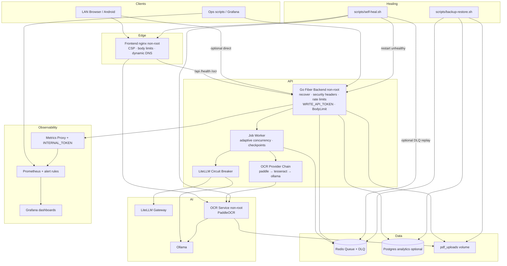
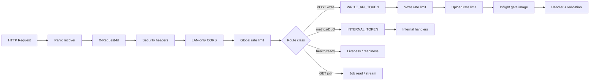

# LokLingo Hardened Architecture

Last updated: 2026-07-17

## Runtime topology (LAN-first)

## Security control plane

## Production container posture

| Service | User | Root FS | Caps | Notes |
| --- | --- | --- | --- | --- |
| backend | `loklingo` | read-only (prod) | drop ALL | tmpfs `/tmp`; pdf volume RW |
| frontend | `nginx` | read-only (prod) | drop ALL | listens 8080; dynamic resolver |
| ocr | `ocr` | RW (models) | drop ALL | shared volume RO for inputs |
| ollama | image default | RW data vol | no-new-privileges | host port optional |

## Fallback & self-healing matrix

| Failure | Detection | Automatic response | Manual |
| --- | --- | --- | --- |
| Backend panic | recover middleware | 500, process lives | logs |
| Backend down | healthcheck + self-heal | container restart | compose logs |
| OCR down | ready + OCR health | OCR chain fallback; self-heal restart | ocr-crash.md |
| LLM timeouts | circuit breaker metrics | open circuit, reject/failover | provider health API |
| Stuck jobs | `loklingo_queue_stuck_jobs` | RecoverStale on dequeue; self-heal restart | stuck-jobs.md |
| Dead letters | DLQ volume alert | optional `SELF_HEAL_REPLAY_DEAD` | reliability-recovery.sh |
| Frontend DNS race | nginx dynamic resolver | re-resolve every 10s | rebuild FE image |

## Related files

- `docker-compose.prod.yml` — security opts, limits, required tokens
- `frontend/nginx.conf` — CSP + dynamic upstreams
- `backend/middleware/security_headers.go` — API headers
- `backend/config/config.go` — production secret validation
- `e2e/` — Playwright security + flow tests
- `scripts/self-heal.sh`, `scripts/backup-restore.sh`
